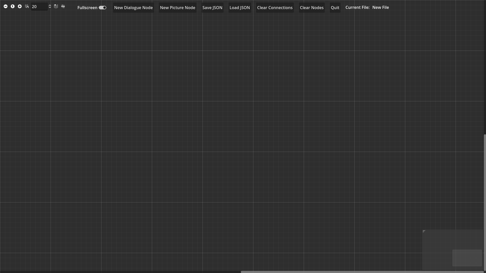

# Silver Window

A visual editor within Godot 4 for displaying text and images in the style of the Silver Case games (Film Window engine).

## Installation

Copy the repository to your machine then import the project file into Godot 4.

## How to use

### Visual Editor

To get started, open the visual editor scene (`visual-editor.tscn`) and run it. You'll see the following empty GraphEdit interface.

There are two types of GraphNodes in the visual editor: dialogue nodes and picture nodes. Dialogue nodes are used to display text boxes and portraits, and picture nodes are used to display all other images. Dialogue nodes are chained together to form a JSON script, and picture nodes are connected to dialogue nodes at the desired start and end points. Each click/button press from the user advances the script from one dialogue node to the next.

For example, the above gif looks like this in the visual editor:

*The `hello-world-screenshot.json` file is included in the JSON folder.*

You'll notice that there are three dialogue nodes in the file, even though only one text box is displayed in the result. When the text field is left blank, the text box is hidden, but still requires an input from the user to move the script forward. This can be useful when you don't want everything to appear or disappear at the same time.

**IMPORTANT!** The order of dialogue connections matters. The nodes are added to the connection list based on *when* they were connected, not how they are arranged from left to right. So if you load a file, then try to add a new connection at the beginning, it will mess everything up. Instead, clear all connections then redo them in the correct order.

(Order does not matter for picture nodes. They can be connected at any time.)

**ALSO IMPORTANT!** The editor requires at least one dialogue connection to generate a JSON file. This means you need a minimum of two dialogue nodes. If you only want to show one text box, leave one of the text fields blank.

### Dialogue Node

GraphNode used for displaying text boxes. Chained together to form a JSON script. Dialogue nodes should be connected in a one-to-one manner (i.e. one *from* connection, one *to* connection per node.)

Add a new dialogue node by clicking the `New Dialogue Node` button or pressing `Ctrl + D`.

Toggling `Show Example Box` displays a draggable text box that will automatically update the node's position fields when moved.

#### Dialogue Node Options

- **Speaker Name** - Name tag for the text box.
- **Positioning Option** - Whether the name tag is displayed above, below, to the left or to the right of the speaker frame.
- **Speaker Frame** - Toggles whether the speaker frame is displayed. Not always needed if the text doesn't correlate to an actual person talking. If a paired image (i.e. portrait) is attached to the text box, this option will be disabled as the frame will automatically surround the paired image.

- **Frame Presets** - `Save` button saves the current frame position, frame size, speaker name and speaker position to a list which can then be selected as a preset. This is useful if you have an image with multiple people in it who are talking back and forth, as you don't have to redo the frame for every new text box. The `remove` button removes a preset from the list.
- **Paired Image** - `Open` adds an image that is tied to the text box. It will appear with the text box and go away when the box is dismissed. Useful for character portraits. The `auto-position` option puts the image on the left, right, top-left or top-right of the text box. The `clear` button removes the paired image. `Preview` shows/hides the preview image in the node.
- **Text** - The text to be displayed in the text box. BBCode tags are supported. By default, the box will automatically adjust to fit the width of the text. If you want a new line, push enter to break manually. The `Center X` option locks the box's x-coordinate to the center of the screen.
- **New Box and Wipe** - `New Box` determines whether the text box is dismissed when the user advances the text. If disabled, the box will wipe itself clean before displaying the next text, or add the text to the next line depending on the `wipe` setting.

*This example shows three clicks/button presses from the player.*

- **Show Example Box** - Shows an example box that can be dragged.
- **End/Start Picture** - Connection points for picture nodes. `Start Picture` means the picture will be displayed at the same time as the text box, `End Picture` means the picture will be ended *before* the text box is displayed. Multiple picture nodes can be connected to the same dialogue node.

    Picture nodes need to have a *start* connection, but the *end* connection can be left blank. In this scenario, the pictures will be ended when the script finishes.

### Picture Node

GraphNode used for displaying images. Connected to dialogue nodes at the start/end slots. Multiple picture nodes can be connected to the same dialogue node slot.

Add a new picture node by clicking the `New Picture Node` button or pressing `Ctrl + P`.

Toggling `Show Example Box` displays a draggable image box that will automatically update the node's position fields when moved.

#### Picture Node Options

Compared to the dialogue node, the picture node is fairly straightforward. Click `Open` to select an image file. Click `clear` to remove it. `Preview` shows/hides the preview image in the node. Size is shown for informational purposes but can't be changed. If you want to resize an image, do it outside Godot and then copy it back in.

(*Note: Functionality for resizing images within the visual editor actually exists within the code, but it's been disabled because it messes with the 'reveal' effect the images have when shrinking/expanding. If you want, you can turn it back on by editing the* `picture_node.tscn` *file.*)

`Center X` locks the image's x-coordinate to the center of the screen. `Show Example Box` shows/hides the draggable image box.

See dialogue node options for connecting picture nodes.

### Saving and Loading

When you're happy with your scene and all the nodes are connected, click `Save JSON` or `Ctrl + S` to save the script. This can then be loaded by clicking `Load JSON` or `Ctrl + L`. The current file will be displayed at the top right of the editor.

### Other Things

Press the `Clear Connections` button or `Ctrl + C` to clear all connections. Press `Clear Nodes` or `Ctrl + W` to clear everything and start a new blank file.

### Main Scene

To actually run the JSON file you created, first open the `StaticData.gd` file located in the singletons folder. Edit the line

    var dialogue_script_file_path = "res://JSONs/hello-world-screenshot.json"

by replacing `hello-world-screenshot.json` with the name of your file. (Alternatively right-click your file in the Godot FileSystem panel and select 'Copy Path', then paste that in.) Then either run `main1.tscn` or click the play button.

To advance the script, use left-click or spacebar.

## Customization

Literally everything in the project can be customized. The background, the fonts, the box colors, the border width, etc. Almost everything is made with Styleboxes, so look into the Godot documentation on them if you want to know more about what you can change.

`dialogue_window.tscn` is the scene for the text boxes, and `picture_window.tscn` is the scene for the image boxes. Edit them to your heart's content.

## Final Notes

I'm making this publically available because I've about reached the limit of what I can do with it on my own. I'm not much of an artist, and my hardware can't really handle anything more intensive (I made this on a Chromebook.) So, basically, if I didn't share this the files would just end up rotting on my hard drive.

### License

Do whatever you'd like with this, commercially or otherwise. Though I'd appreciate it if you give an acknowledgement somewhere in your credits if you end up making something cool.

Peace
